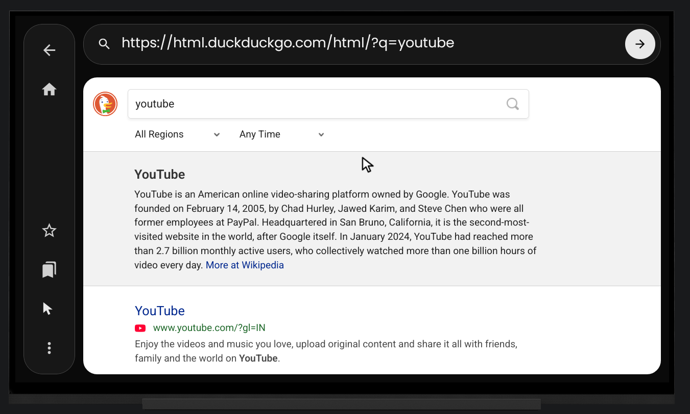
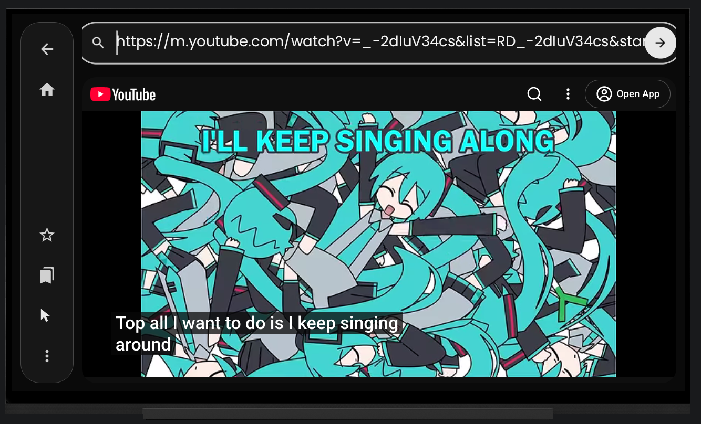

<p align="center">
  
</p>

<h1 align="center">Wishy Browser</h1>

<p align="center">
  <b>A minimal, privacy-first web browser for Android TV.</b><br>
  Built on GeckoView. Designed for the remote. No history, no telemetry, no accounts.
</p>

<p align="center">
  
  
  
  
  
</p>

> **Heads up:** this is a small personal project, tested on an emulator and a phone, with real-TV testing still growing. Some things may not work on your TV. Please read [Known issues and limits](#known-issues-and-limits) and [tell me](#contact-and-bug-reports) if you hit a problem.

---

## Screenshots

### Home


### Search


### Video on the big screen


---

## Why Wishy?

Most TV browsers are either bloated or track you. Wishy does one thing: gives you a search bar, a page, and just enough controls to be comfortable from the couch.

- **Private by default.** Every session runs in private mode. Nothing is written to disk.
- **Made for the remote.** D-pad navigation, plus a virtual mouse pointer for regular websites.
- **Small and auditable.** One Activity, one layout, no tracking SDKs.

---

## Features

### Privacy and security

| Feature | Details |
| --- | --- |
| **Tracker and ad blocking** | Enhanced Tracking Protection set to *Strict*, always on |
| **Anti-fingerprinting** | Normalizes fonts, canvas, timezone and other identifying surfaces |
| **Cookie protection** | Third-party and tracker cookies are rejected |
| **No history** | Private-browsing mode for every session, nothing persists across launches |
| **No telemetry** | No Glean, no crash reporter, no analytics SDK |
| **Global Privacy Control** | Every site is told not to sell or share your visit |
| **Clean links** | Tracking parameters (`utm_*`, `fbclid` and similar) are stripped from links |
| **Nothing else phones home** | Telemetry, studies, push messaging, captive-portal checks, notifications and location are switched off. See [Privacy: what still connects out](#privacy-what-still-connects-out) for the two things that still do |
| **No proprietary code** | Google Play Services (normally pulled in by GeckoView for passkeys) is left out. The APK contains only open-source components |
| **No accounts** | No sign-in and no Firefox Account or Sync code |

### Browsing

- **Smart address bar:** `192.168.1.10:8080` opens over HTTP (routers, NAS, Plex), domains open over HTTPS, and anything else becomes a search.
- **Bookmarks:** star button, remote-friendly list, duplicate-safe, stored only on your device.
- **Menu:** back, forward, reload, home, custom home page, desktop-site toggle, and text size (100% to 200%).
- **Fullscreen video:** the bar hides and Back exits fullscreen.
- **Load progress line:** tells you a slow page from a dead one.
- **New-tab links:** links that try to open a new window load in the current tab instead.

### TV-first design

- Material 3 dark theme with a solid background (no feeds, wallpapers or recommendations).
- White focus outline on every button the remote lands on.
- Visible cursor on both light and dark pages.

---

## Using it with a remote

| Do this | To get this |
| --- | --- |
| **★** button in the address bar | Bookmark or un-bookmark the current page (star turns yellow when saved) |
| **Bookmarks** button (or the remote's BOOKMARK key) | Open the list: **OK** opens, **Right** deletes, **Back** closes |
| **⋮** button | Menu: Back, Forward, Reload, Home, *Set this page as home*, Desktop site on/off, Text size, Exit |
| **MENU** key or pointer button | Toggle **pointer mode**: D-pad moves the cursor, **OK** clicks, hold a direction to speed up |
| Cursor pushed to the top or bottom edge | Scrolls the page; push **Up** at the very top to reach the address bar |
| **CH+ / CH−** or **Page Up / Down** | Scroll a screenful |
| **BACK** | Closes fullscreen video, then pointer mode, then goes back a page, then jumps to the address bar. Press Back again to exit |

**Keyboard shortcuts:** `Ctrl+D` bookmark · `Ctrl+B` bookmarks · `Ctrl+L` address bar · `Ctrl+R` / `F5` reload

> **Tip:** TV-optimized sites work with the D-pad out of the box. For ordinary desktop or mobile sites, press **MENU** to switch on the pointer.

---

## Getting started

### Easiest: let GitHub build it for you

Push the project to GitHub. The included workflow (`.github/workflows/build.yml`) builds the APK on every push. Open the **Actions** tab, pick the latest run and download **WishyBrowser-apk**. Push a tag such as `v2.0.0` and the APK is also attached to a GitHub Release.

### Build it yourself (one click)

Requirements: the latest stable **Android Studio** (it bundles JDK 21 and offers to install the Android SDK 37 platform on first sync) and an internet connection.

1. Open the project folder in Android Studio and let the first Gradle sync finish (it downloads the GeckoView engine once).
2. Choose **Build > Build Bundle(s) / APK(s) > Build APK(s)**.
3. Your installable APK is copied to **`dist/`** in the project folder. Every build type is shrunk and signed, so any of them installs directly.

Command line: `./gradlew assembleRelease` (Windows: `gradlew.bat assembleRelease`). Use JDK 17 or newer.

### Install on the TV

```
adb connect <tv-ip-address>
adb install -r dist/app-release.apk
```

Or copy the APK to a USB stick, or use the Downloader app, and open it on the TV.

### What the build gives you

- **One universal APK** with 32-bit and 64-bit ARM, which covers essentially every Android TV, Google TV and Fire TV device from Android 8.0 up. Native libraries are stored compressed to roughly halve the file size.
- To run on an **x86_64 emulator**, add `wishy.includeX86=true` to `gradle.properties` and build again.
- If you change the GeckoView version, pick one from [maven.mozilla.org](https://maven.mozilla.org/maven2/org/mozilla/geckoview/geckoview/) and check the code still compiles; GeckoView's API changes between major versions.

---

## Compatibility

- **Android 8.0 (API 26) and newer.** This is the floor of the current Firefox engine (Mozilla dropped Android 5 to 7 in Firefox 144). Older Fire TV sticks running Fire OS 5 or 6 cannot run a modern, patched engine and are not supported.
- **Works on Fire TV and generic Android TV boxes**, not just Google-certified devices. `android.software.leanback` is declared `required="false"` so stores don't hide the app from them.
- **Landscape only** for consistent behavior on every TV form factor, including hybrid boxes that default to portrait.
- **Shows up on every launcher.** The app registers for both the Android TV (Leanback) launcher and the standard one, so cheap boxes with a normal launcher list it too.
- **Adaptive icon** plus legacy PNGs for every density.
- **TV banner** is a true 320×180 asset, the exact size the Leanback launcher expects.

---

## What's stored, and what isn't

Wishy stores **only** the following, in the app's private storage, and only when you choose to save them:

- Bookmarks
- Home page
- Desktop-site mode
- Text size

Browsing history, cookies and form data are **never** written to disk.

**Left out on purpose** (to keep the app small and auditable): tabs, a history list, a downloads manager, extensions, and any kind of account or sync.

---

## Under the hood

| Layer | Choice |
| --- | --- |
| **Engine** | [Mozilla GeckoView](https://mozilla.github.io/geckoview/) as a prebuilt Maven artifact (MPL-2.0). No Firefox source is forked, and no Firefox branding, telemetry, experiments or sync code is included |
| **UI** | Single `Activity`, Material Components (`MaterialCardView`, `MaterialButton`, `Theme.Material3.Dark`), Material Icons (Apache-2.0) |
| **Language** | Kotlin |
| **Privacy config** | `BrowserApplication.kt` |
| **Input handling** | `MainActivity.kt` |
| **Bookmarks** | `BookmarkStore.kt` (JSON in SharedPreferences), `BookmarksDialog.kt` (RecyclerView) |

### Developer notes

- **Toolchain:** Gradle 9.7, Android Gradle Plugin 9.4 (Kotlin is built in), Kotlin 2.4, compile SDK 37, target SDK 36, GeckoView 155 (Firefox 155).
- **Key handling** lives in `MainActivity.dispatchKeyEvent` on Android 12 and older, because GeckoView consumes D-pad and Back events before `onKeyDown` runs. On Android 13+ Back goes through the predictive-back `OnBackPressedCallback` instead.
- **Passkeys are off.** GeckoView's WebAuthn code depends on Google Play Services, which is proprietary. This build excludes it (`app/build.gradle.kts`) and disables WebAuthn in `BrowserApplication.kt`, so sites fall back to passwords. To re-enable passkeys, remove the `exclude` and the `security.webauth.webauthn` pref.
- **Backups:** `allowBackup` is off, so bookmarks do not survive an uninstall.
- **Updates:** there is no in-app auto-update. GeckoView does not update independently of your app releases, so rebuild against a newer GeckoView regularly for security fixes.
- **Signing:** builds are signed with the local debug key so they install directly. Use your own keystore if you publish through a store.

---

## Known issues and limits

Being upfront about what can go wrong:

**Devices**
- **Android 8.0 (API 26) or newer only.** Older Fire TV sticks (Fire OS 5 and 6) and Android TV boxes on Android 7 or below cannot run the current engine.
- **Big install.** The APK is about 157 MB and needs roughly 300 MB of free space once installed. Very cheap TV sticks with little storage may fail to install it.
- **Needs memory.** GeckoView is a full Firefox engine. On a stick with about 1 GB of RAM it can be slow, reload pages, or be closed by the system.
- **Only tested so far** on an Android TV emulator and an Android phone. Different TV brands (Fire TV, Xiaomi, TCL, Sony, generic boxes) may behave differently with the remote, Back button, fullscreen video or the pointer.
- **Phones:** it installs and runs, but the layout is built for a TV and is locked to landscape. It is not a phone browser.

**Features that are off or missing on purpose**
- **No passkeys or security keys.** They depend on Google Play Services (proprietary), which this build leaves out. Password logins work; sites that require a passkey will not.
- **No notifications, push messages or location.** These are switched off.
- **Everything is private mode.** Nothing is remembered, so sites will not keep you logged in after you close the app.
- **No tabs, history list, downloads manager, extensions or sync.**
- **No automatic updates.** Browsers need security fixes often. The engine only updates when the app is rebuilt against a newer GeckoView, so check for new releases.

**Things that may go wrong**
- Some sites detect an unusual browser and ask for extra checks or refuse to load. Strict tracking protection and fingerprint resistance can also break a few sites (logins, payments, embedded videos).
- Streaming sites that need DRM (Netflix, Disney+ and similar) may not play. YouTube and most other video sites are fine.
- Pointer mode is a workaround for mouse-only pages. It can be fiddly on pages with lots of small buttons.
- If you install a build signed with a different key (for example a GitHub Actions build over a release APK), Android will say the app conflicts. Uninstall the old one first; saved bookmarks will be lost.

---

## Privacy: what still connects out

Wishy sends no analytics, accounts or browsing history anywhere. Two engine features still make network requests, and you should know about them:

1. **Safe Browsing (Google).** GeckoView checks pages against Google's phishing and malware lists. It downloads the lists and sends short hash prefixes of sites that match, not full addresses. This protects you from bad sites. It can be turned off in `BrowserApplication.kt` with `.safeBrowsing(ContentBlocking.SafeBrowsing.NONE)`, at the cost of no phishing or malware warnings.
2. **Tracker lists (Mozilla).** The tracking-protection lists are updated from Mozilla's servers.

And of course the sites you visit, and the search engine you use, see your IP address like any other website. Wishy does not hide your IP; use a VPN or router-level privacy for that.

---

## Contact and bug reports

Something not working on your TV? I want to hear about it.

- **Report a bug or ask a question:** open an issue at [github.com/wishissue/WishyBrowser/issues](https://github.com/wishissue/WishyBrowser/issues)
- **Contact me directly:** [github.com/wishissue](https://github.com/wishissue)

A good bug report includes:
- your TV or box model and Android version,
- what you did and what happened instead,
- a screenshot if possible,
- the log, if you can get it: `adb logcat -d | grep -i -E "wishy|gecko|fatal"`

Ideas and pull requests are welcome too. This is a spare-time project, so replies may take a while.

---

## Credits and licenses

- Browser engine: [Mozilla GeckoView](https://mozilla.github.io/geckoview/) (MPL-2.0)
- Icons: [Material Icons](https://fonts.google.com/icons) (Apache-2.0)
- UX reference: TV Bro was reviewed for the pointer-mode pattern only. **No TV Bro code is used.**

See [`NOTICE.md`](NOTICE.md) for the full accounting.

---

<p align="center">
  Made for the couch. 🐱
</p>
